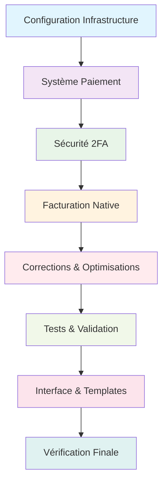

# 🛒 E-Commerce Platform Django

Plateforme e-commerce complète développée avec Django, intégrant un système de paiement avancé avec Stripe et PayPal, authentification à double facteur, et système de facturation natif.

## 🚀 Fonctionnalités Principales

### 💳 Système de Paiement Complet
- **Intégration Stripe** : Cartes de crédit, paiements sécurisés, webhooks
- **Intégration PayPal** : Paiements PayPal, abonnements
- **Gestion des méthodes de paiement** : Sauvegarde sécurisée, cartes par défaut
- **Webhooks temps réel** : Synchronisation automatique des paiements
- **Facturation native** : Génération et gestion des factures

### 🔐 Sécurité Avancée
- **Authentification 2FA** : TOTP avec Google Authenticator
- **Protection CSRF** : Sécurisation des formulaires
- **Validation des webhooks** : Signatures cryptographiques
- **Gestion des sessions** : Expiration automatique

### 📦 Gestion E-Commerce
- **Catalogue produits** : Articles, catégories, images
- **Panier d'achat** : Gestion quantités, totaux
- **Gestion stock** : Suivi inventaire en temps réel
- **Commandes** : Workflow complet de la commande à la livraison

### 🏪 Interface Administration
- **Dashboard admin** : Vue d'ensemble des ventes
- **Gestion produits** : CRUD complet avec upload d'images
- **Suivi commandes** : États, historique, notifications
- **Analytiques** : Rapports de vente, statistiques

## 🛠️ Technologies Utilisées

### Backend
- **Django 5.2.4** - Framework web Python
- **SQLite** - Base de données (développement)
- **Pillow** - Traitement d'images
- **django-environ** - Gestion variables d'environnement

### Paiements & Facturation
- **Stripe 11.6.0** - Processeur de paiement principal
- **PayPal REST SDK** - Intégration PayPal
- **Facturation native** - Système interne de factures

### Sécurité & Authentification
- **django-two-factor-auth** - Authentification 2FA
- **django-otp** - Codes à usage unique
- **pyotp** - Génération TOTP
- **qrcode** - QR codes pour configuration 2FA

### Interface Utilisateur
- **django-crispy-forms** - Formulaires stylisés
- **django-formtools** - Formulaires multi-étapes
- **Templates Bootstrap** - Interface responsive

## 📦 Installation

### Prérequis
- Python 3.11+
- pip
- virtualenv (recommandé)

### Configuration

1. **Cloner le projet**
```bash
git clone https://github.com/Flamingo12345678/E-Commerce
cd E-Commerce
```

2. **Créer un environnement virtuel**
```bash
python -m venv env
source env/bin/activate  # macOS/Linux
# ou
env\Scripts\activate     # Windows
```

3. **Installer les dépendances**
```bash
pip install -r requirements.txt
```

4. **Configuration des variables d'environnement**
```bash
cp .env.example .env
```

Éditer `.env` avec vos clés :
```env
# Django
SECRET_KEY=votre-cle-secrete-django
DEBUG=True
ALLOWED_HOSTS=localhost,127.0.0.1

# Stripe
STRIPE_PUBLISHABLE_KEY=pk_test_...
STRIPE_SECRET_KEY=sk_test_...
STRIPE_ENDPOINT_SECRET=whsec_...

# PayPal
PAYPAL_CLIENT_ID=votre-client-id
PAYPAL_CLIENT_SECRET=votre-secret
PAYPAL_MODE=sandbox  # ou 'live' pour production
```

5. **Migrations et setup initial**
```bash
python manage.py migrate
python manage.py collectstatic
python manage.py createsuperuser
```

6. **Lancer le serveur de développement**
```bash
python manage.py runserver
```

L'application sera accessible sur `http://127.0.0.1:8000/`

## 🔧 Configuration Avancée

### Configuration Stripe

1. **Créer un compte Stripe** sur [stripe.com](https://stripe.com)
2. **Récupérer les clés API** dans le dashboard Stripe
3. **Configurer les webhooks** :
   - URL : `https://votre-domaine.com/accounts/webhook/stripe/`
   - Événements : `payment_intent.succeeded`, `payment_method.attached`

### Configuration PayPal

1. **Créer une application PayPal** sur [developer.paypal.com](https://developer.paypal.com)
2. **Récupérer Client ID et Secret**
3. **Configurer les URLs de retour** dans votre application PayPal

### Configuration 2FA

L'authentification à double facteur est automatiquement disponible :
- Accès via `/account/login/`
- Configuration QR code dans le profil utilisateur
- Support Google Authenticator, Authy, etc.

## 🧪 Tests

### Lancer les tests
```bash
# Tests complets
python manage.py test

# Tests spécifiques
python manage.py test accounts.tests
python manage.py test store.tests

# Tests de paiement
python test_payment_system.py
python test_webhooks.py
```

### Tests d'intégration paiement
```bash
# Test Stripe
python test_integration_payment.py

# Test méthodes de paiement
python test_payment_methods.py
```

## 📊 Monitoring & Logs

### Logs disponibles
- `django.log` - Logs généraux de l'application
- `payment.log` - Logs spécifiques aux paiements
- `webhook_debug.log` - Debug des webhooks

### Commandes utiles
```bash
# Vérifier les logs en temps réel
tail -f django.log
tail -f payment.log

# Debug webhooks
python debug_webhooks.py
```

## 🚀 Déploiement

### Variables d'environnement production
```env
DEBUG=False
ALLOWED_HOSTS=votre-domaine.com
SECRET_KEY=cle-secrete-forte

# URLs de production
STRIPE_PUBLISHABLE_KEY=pk_live_...
STRIPE_SECRET_KEY=sk_live_...
PAYPAL_MODE=live
```

### Checklist déploiement
- [ ] Variables d'environnement configurées
- [ ] Base de données migrée
- [ ] Fichiers statiques collectés
- [ ] HTTPS configuré
- [ ] Webhooks configurés avec les bonnes URLs
- [ ] Backups automatiques configurés

## 📚 Documentation Technique & Architecture

### 🏗️ Architecture du Projet

```
E-Commerce/
├── accounts/                    # 👤 Gestion utilisateurs, paiements, facturation
│   ├── models.py               # Modèles User, PaymentMethod, Transaction
│   ├── payment_services.py     # Services Stripe/PayPal
│   ├── invoice_services.py     # Système de facturation native
│   ├── webhook_services.py     # Gestion webhooks
│   └── admin_views.py          # Interface d'administration
├── store/                      # 🛍️ Catalogue, panier, commandes
│   ├── models.py               # Modèles Product, Order, Cart
│   ├── views.py                # Vues e-commerce
│   └── catalog_views.py        # Gestion catalogue
├── shop/                       # ⚙️ Configuration Django principale
│   ├── settings.py             # Configuration générale
│   ├── urls.py                 # Routage principal
│   └── wsgi.py                 # Déploiement WSGI
├── templates/                  # 🎨 Templates HTML
├── static/                     # 📁 Fichiers CSS, JS, images
├── media/                      # 📸 Uploads utilisateurs
├── docs/                       # 📚 Documentation complète (31 fichiers)
│   ├── README.md               # Index de la documentation
│   ├── SYSTEME_FACTURATION_*.md
│   ├── RAPPORT_*.md
│   ├── MISSION_*.md
│   ├── CORRECTION_*.md
│   └── GUIDE_*.md
└── requirements.txt            # Dépendances Python
```

### 📋 Documentation des Opérations Réalisées

> 📁 **Toute la documentation technique est organisée dans le dossier [`docs/`](./docs/)** 
> 
> **Index complet** : [docs/README.md](./docs/README.md)

#### 🔧 **Phase 1 : Configuration & Infrastructure**
- **[RAPPORT_ADMIN_UPDATE_FINAL.md](./docs/RAPPORT_ADMIN_UPDATE_FINAL.md)** - Mise à jour interface administration
- **[SYSTEME_FACTURATION_GUIDE.md](./docs/SYSTEME_FACTURATION_GUIDE.md)** - Guide complet système de facturation
- **[SYSTEME_FACTURATION_NATIF.md](./docs/SYSTEME_FACTURATION_NATIF.md)** - Implémentation facturation native

#### 💳 **Phase 2 : Système de Paiement**
- **[RAPPORT_FINAL_IMPLEMENTATION_PAIEMENT.md](./docs/RAPPORT_FINAL_IMPLEMENTATION_PAIEMENT.md)** - Implémentation complète Stripe/PayPal
- **[INTEGRATION_PAIEMENTS_COMPLETE.md](./docs/INTEGRATION_PAIEMENTS_COMPLETE.md)** - Intégration des systèmes de paiement
- **[RAPPORT_VERIFICATION_SYSTEME_PAIEMENT.md](./docs/RAPPORT_VERIFICATION_SYSTEME_PAIEMENT.md)** - Vérification et validation
- **[GUIDE_TEST_PAIEMENTS.md](./docs/GUIDE_TEST_PAIEMENTS.md)** - Guide de test des paiements

#### 🔐 **Phase 3 : Sécurité & Authentification**
- **[MISSION_2FA_ACCOMPLIE.md](./docs/MISSION_2FA_ACCOMPLIE.md)** - Implémentation authentification 2FA
- **[RAPPORT_2FA_IMPLEMENTATION.md](./docs/RAPPORT_2FA_IMPLEMENTATION.md)** - Rapport technique 2FA
- **[RAPPORT_WEBHOOKS_FINAL.md](./docs/RAPPORT_WEBHOOKS_FINAL.md)** - Sécurisation webhooks

#### 🧾 **Phase 4 : Facturation & Gestion**
- **[RAPPORT_IMPLEMENTATION_FACTURATION_FINAL.md](./docs/RAPPORT_IMPLEMENTATION_FACTURATION_FINAL.md)** - Système facturation final
- **[RAPPORT_MIGRATION_FACTURATION_NATIVE_FINAL.md](./docs/RAPPORT_MIGRATION_FACTURATION_NATIVE_FINAL.md)** - Migration vers facturation native
- **[RAPPORT_NETTOYAGE_PAIEMENTS.md](./docs/RAPPORT_NETTOYAGE_PAIEMENTS.md)** - Optimisation système paiements

#### 🐛 **Phase 5 : Corrections & Optimisations**
- **[CORRECTIONS_PRIORITAIRES.md](./docs/CORRECTIONS_PRIORITAIRES.md)** - Liste des corrections prioritaires
- **[CORRECTION_1_COMPTEUR_PANIER.md](./docs/CORRECTION_1_COMPTEUR_PANIER.md)** - Fix compteur panier
- **[CORRECTION_2_GESTION_STOCK.md](./docs/CORRECTION_2_GESTION_STOCK.md)** - Amélioration gestion stock
- **[CORRECTION_3_REQUETES_OPTIMISEES.md](./docs/CORRECTION_3_REQUETES_OPTIMISEES.md)** - Optimisation requêtes base de données
- **[CORRECTION_IMAGES_CARTES.md](./docs/CORRECTION_IMAGES_CARTES.md)** - Fix affichage images produits

#### 🧪 **Phase 6 : Tests & Validation**
- **[MISSION_TESTS_ACCOMPLIE.md](./docs/MISSION_TESTS_ACCOMPLIE.md)** - Implémentation tests complets
- **[RAPPORT_TESTS_ADMIN_COMPLETS.md](./docs/RAPPORT_TESTS_ADMIN_COMPLETS.md)** - Tests interface administration
- **[RAPPORT_TESTS_UNITAIRES.md](./docs/RAPPORT_TESTS_UNITAIRES.md)** - Tests unitaires du système
- **[RAPPORT_VERIFICATION_LOGIQUE_METIER.md](./docs/RAPPORT_VERIFICATION_LOGIQUE_METIER.md)** - Validation logique métier

#### 🎨 **Phase 7 : Interface & Templates**
- **[VERIFICATION_TEMPLATE_CHECKOUT.md](./docs/VERIFICATION_TEMPLATE_CHECKOUT.md)** - Validation templates checkout
- **[RAPPORT_VERIFICATION_TEMPLATES.md](./docs/RAPPORT_VERIFICATION_TEMPLATES.md)** - Vérification tous templates
- **[HERO_SECTION_UPDATE.md](./docs/HERO_SECTION_UPDATE.md)** - Mise à jour section hero
- **[HERO_FULLSCREEN_UPDATE.md](./docs/HERO_FULLSCREEN_UPDATE.md)** - Hero en plein écran
- **[LANDING_PAGE_PROFESSIONNELLE.md](./docs/LANDING_PAGE_PROFESSIONNELLE.md)** - Page d'accueil professionnelle

#### ✅ **Phase 8 : Vérification Finale & Audit**
- **[RAPPORT_FINAL_VERIFICATION_COMPLETE.md](./docs/RAPPORT_FINAL_VERIFICATION_COMPLETE.md)** - Vérification complète du système
- **[RAPPORT_AUDIT_LANDING_PAGE_LOGIQUE_METIER.md](./docs/RAPPORT_AUDIT_LANDING_PAGE_LOGIQUE_METIER.md)** - Audit final
- **[RAPPORT_CORRECTION_ERREURS_PAIEMENT.md](./docs/RAPPORT_CORRECTION_ERREURS_PAIEMENT.md)** - Correction erreurs finales
- **[RAPPORT_CORRECTION_ARTICLES_PAIEMENT.md](./docs/RAPPORT_CORRECTION_ARTICLES_PAIEMENT.md)** - Fix articles et paiement

### 🔄 Workflow des Opérations



### 📊 État des Fonctionnalités

| Fonctionnalité | État | Documentation |
|---|---|---|
| 💳 Paiements Stripe | ✅ Complet | `docs/RAPPORT_FINAL_IMPLEMENTATION_PAIEMENT.md` |
| 💰 Paiements PayPal | ✅ Complet | `docs/INTEGRATION_PAIEMENTS_COMPLETE.md` |
| 🔐 Authentification 2FA | ✅ Complet | `docs/MISSION_2FA_ACCOMPLIE.md` |
| 🧾 Facturation Native | ✅ Complet | `docs/SYSTEME_FACTURATION_NATIF.md` |
| 🛒 Gestion Panier | ✅ Corrigé | `docs/CORRECTION_1_COMPTEUR_PANIER.md` |
| 📦 Gestion Stock | ✅ Optimisé | `docs/CORRECTION_2_GESTION_STOCK.md` |
| 🔍 Optimisation DB | ✅ Complet | `docs/CORRECTION_3_REQUETES_OPTIMISEES.md` |
| 🧪 Tests Complets | ✅ Validé | `docs/MISSION_TESTS_ACCOMPLIE.md` |
| 🎨 Interface UI | ✅ Finalisé | `docs/LANDING_PAGE_PROFESSIONNELLE.md` |
| 🔒 Webhooks Sécurisés | ✅ Actif | `docs/RAPPORT_WEBHOOKS_FINAL.md` |

### 🎯 Points Clés de l'Architecture

1. **Séparation des responsabilités** : Modules distincts pour paiements, facturation, e-commerce
2. **Sécurité multicouche** : 2FA, validation webhooks, protection CSRF
3. **Intégration multi-fournisseurs** : Stripe ET PayPal pour maximum compatibilité
4. **Facturation native** : Système interne complet avec templates personnalisables
5. **Tests exhaustifs** : Couverture complète des fonctionnalités critiques
6. **Interface responsive** : Design adaptatif desktop/mobile
7. **Monitoring intégré** : Logs détaillés pour debug et suivi

## 🤝 Contribution

1. Fork le projet
2. Créer une branche feature (`git checkout -b feature/nouvelle-fonctionnalite`)
3. Commit les changements (`git commit -am 'Ajout nouvelle fonctionnalité'`)
4. Push la branche (`git push origin feature/nouvelle-fonctionnalite`)
5. Créer une Pull Request

## 📄 Licence

Ce projet est sous licence MIT. Voir le fichier `LICENSE` pour plus de détails.

## 🆘 Support

### Issues communes

**Erreur de webhook Stripe**
```bash
# Vérifier la signature
python test_stripe_signature.py
```

**Problème de paiement PayPal**
```bash
# Debug PayPal
python debug_webhook_headers.py
```

**Erreur 2FA**
- Vérifier la synchronisation de l'horloge
- Regénérer le QR code si nécessaire

### Contact
- 📧 Email : [votre-email]
- 🐛 Issues : [lien-vers-issues]
- 📖 Wiki : [lien-vers-wiki]

---

**🎉 Plateforme e-commerce prête pour la production !**

✅ Paiements sécurisés | ✅ 2FA activé | ✅ Facturation native | ✅ Interface admin complète

Merci de contribuer à ce projet ! Pour toute question, n'hésitez pas à ouvrir une issue ou à nous contacter directement.
# 🛒 E-Commerce Platform Django